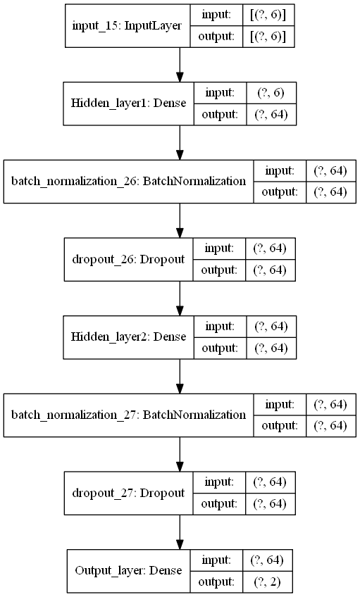
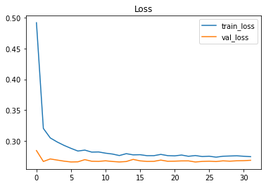
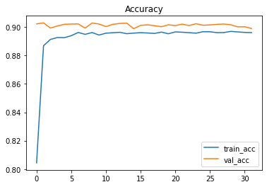
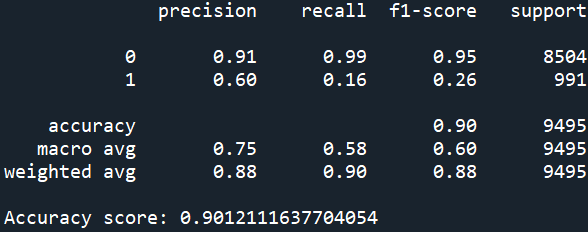

# Outcome Prediction Using Deep Learning Model for Customer Campaign.
 Trained over 31,000 data to predict the outcome of the term deposit subscription by customer based on a campaign.

## Description
1. The project's objective is to predict the chance the outcome of a campaign based on the customer's data
2. Based on the dataset description, the dataset contains details of marketing campaigns done via phonecall with various details for customers such as demographics, last campaign details, many more.
3. The dataset contains 6 continuous features, 10 categorical features, 1 categorical target. It has no duplicate data but has a lot of NaNs especially for 'days_since_prev_campaign_contact' column. The dataset can be downloaded from the link given in the credit section below.
4. The only features selected from the dataset are all of the continuous columns since they have the highest correlation to the target, which is outcome of the campaign.
5. By using the simple two layer deep learning model, 
6. Methods that can be used to improve the model such as increasing the amount of data to be train and reducing the outliers.

### Deep learning model image

## Results
Training loss & Validation loss:

Training accuracy & Validation accuracy:

Model score:

## Discussion
1. The best machine learning model achieved 85.7% accuracy during model testing. 
2. Recall and f1 score report 93% and 89% respectively. 
3. After the deployment of the Streamlit app, 10 new data inside the Assignment 1.pdf file were tested by key in the data needed, 8 over 10 data outputs were predicted correctly. The other two data that give the wrong outputs are the row of age 45 and age 69.

## Credits:
Shout out to Kunal Gupta from Kaggle for the Customer Segmentation Dataset. Check out the dataset by clicking the link below. :smile:
### Dataset link
[HackerEarth HackLive: Customer Segmentation](https://www.kaggle.com/datasets/kunalgupta2616/hackerearth-customer-segmentation-hackathon)
